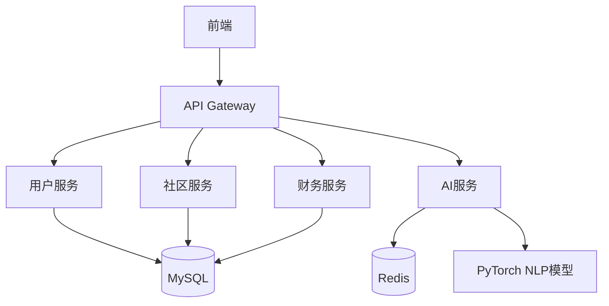

# BeMan 全栈技术方案

## 技术架构


## 前端实现（Vue3）
```javascript:%2Fe%3A%2Flq%2Fcode%2Fbeman%2Ffront%2Fvue.config.js
module.exports = {
  css: {
    loaderOptions: {
      scss: {
        additionalData: `@import "@/styles/_variables.scss";`
      }
    }
  }
}
```

## 后端模块划分
```java:%2Fe%3A%2Flq%2Fcode%2Fbeman%2Fbackend%2Fsrc%2Fmain%2Fjava%2Fcom%2Fbeman%2F
├── user/
│   ├── AuthController.java
│   └── JwtFilter.java
├── community/
│   ├── PostService.java
│   └── ContentFilter.java
├── finance/
│   ├── BillParser.java
│   └── ReportGenerator.java
└── ai/
    ├── EmotionAnalyzer.java
    └── SuggestionEngine.java
```

## AI服务集成
```python:%2Fe%3A%2Flq%2Fcode%2Fbeman%2Fai%2Femotion_analysis.py
class EmotionDetector:
    def analyze(text):
        # 使用BERT模型进行情绪分析
        inputs = tokenizer(text, return_tensors="pt")
        outputs = model(**inputs)
        return {
            "emotion": emotion_labels[outputs.logits.argmax()],
            "confidence": torch.max(F.softmax(outputs.logits, dim=1)).item()
        }
```

## 基础设施
```bash
# Docker 部署配置
docker-compose up -d \
  --build nginx \
  --build spring-boot \
  --build vue \
  --build python-ai
```

完整方案包含：
- 前端组件化设计规范
- 微服务API文档（OpenAPI 3.0）
- AI模型训练部署流程
- 安全审计方案（含敏感数据处理机制）