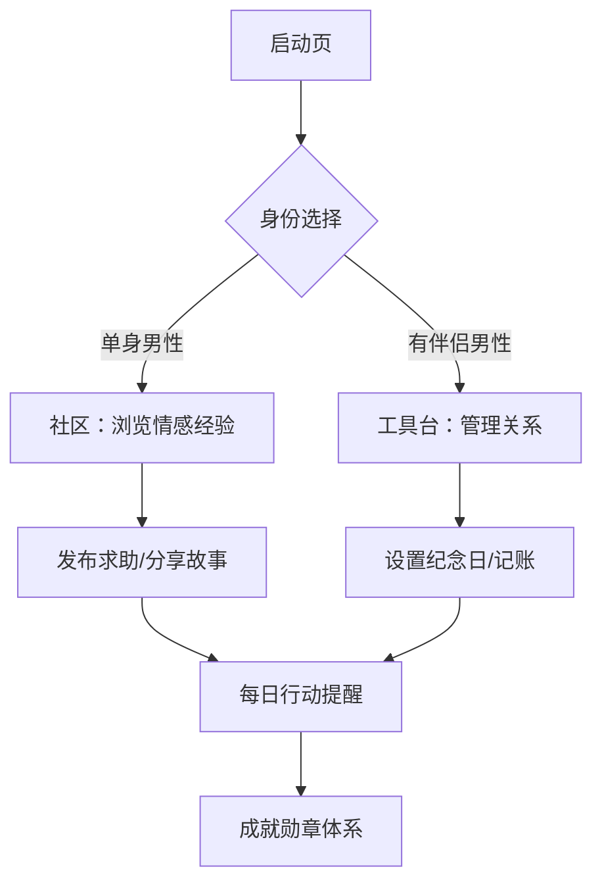
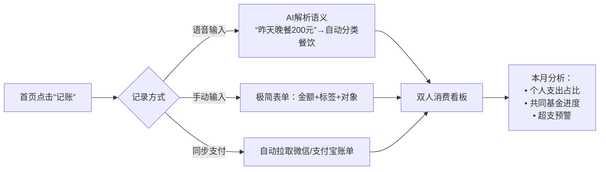
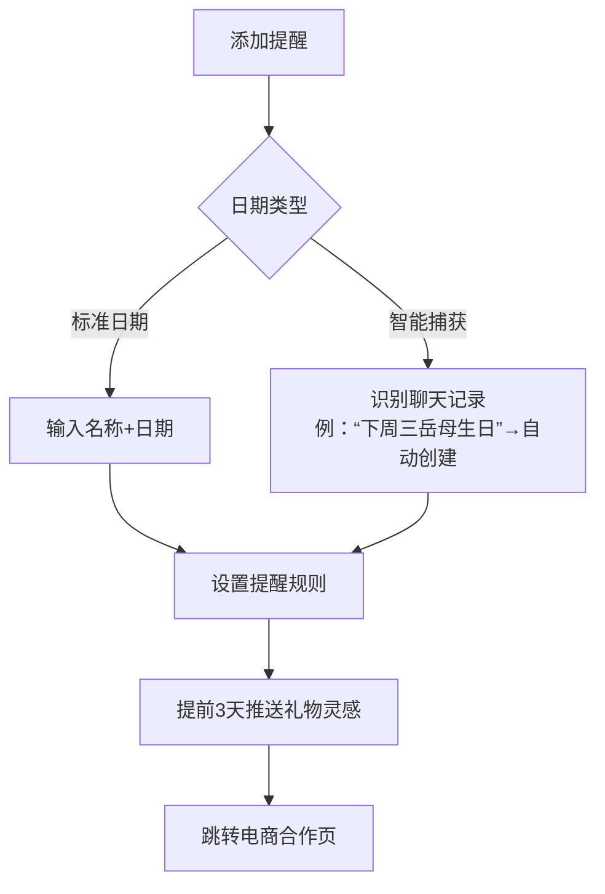
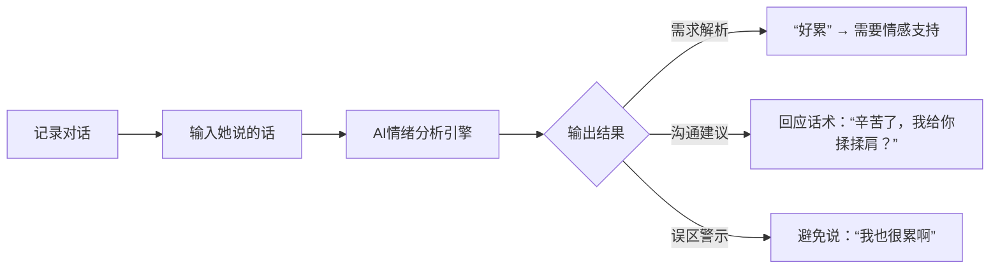
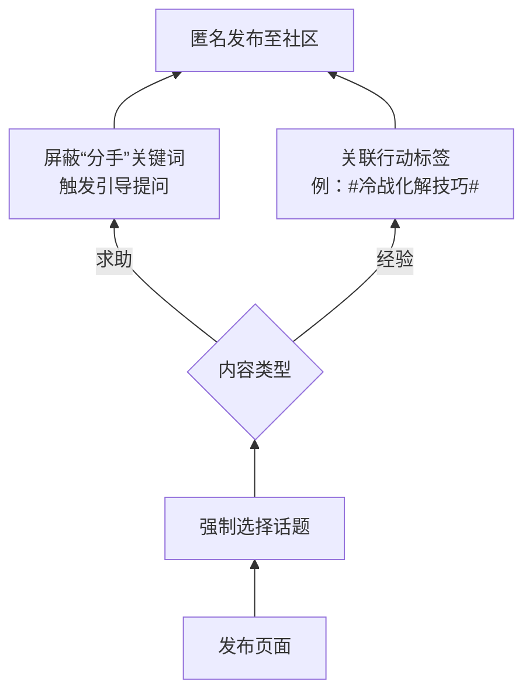

基于产品需求文档，我为您设计**核心功能流程图+高保真交互原型框架**，聚焦**男性用户高效操作路径**，可直接用于AI编程逻辑开发。以下为关键模块实现方案：

---

### **一、全局用户旅程图**


---

### **二、核心功能流程图 & 原型说明**
#### **1. 财务透明化模块**


**交互原型关键点**：
- **语音记账界面**  
    
  *技术需求：实时语音转文字+关键词提取（金额/品类）*
  
- **消费看板可视化**  
  ```python
  # 伪代码-看板数据处理逻辑
  def show_expense(uid):
      personal = db.query(用户支出).filter(标签!=共同基金)
      shared = db.query(共同基金支出)
      return {
          "个人消费环形图": {categories: [餐饮, 购物, 娱乐], values: [35%, 40%, 25%]},
          "共同储蓄进度条": f"{shared.amount}/{shared.goal} ({shared.progress}%)"
      }
  ```

#### **2. 日程管家模块**


**交互原型关键点**：  
- **日期添加页**  
    
  *特色功能：礼物偏好标签库（需用户预先设置伴侣喜好）*
  
- **AI日期捕获逻辑**  
  ```javascript
  // 伪代码-自然语言识别
  function parseDate(text){
    if(/生日|纪念日|过节/.test(text)) 
      return { 
        type: "IMPORTANT", 
        date: extractDate(text), // 使用正则提取日期
        giftLevel: text.includes("生日") ? "HIGH" : "MEDIUM" 
      }
  }
  ```

#### **3. 情绪解码器模块**


**交互原型关键点**：  
- **分析结果页设计**  
    
  *技术说明：使用预训练婚姻咨询NLP模型*

#### **4. 男性社区模块**


**交互原型关键点**：  
- **反极端内容机制**  
  ```python
  # 内容安全过滤伪代码
  def check_content(text):
      banned_words = ["分手", "离婚", "女人都"]
      if any(word in text for word in banned_words):
          show_modal("试试换个角度思考：\n『我们如何改善这个情况？』") 
          return False
      return True
  ```

---

### **三、技术实施清单**
| 模块         | 必接API                     | 输出数据类型       | 隐私保护措施              |
|--------------|----------------------------|-------------------|--------------------------|
| 语音记账     | 微信/支付宝开放平台          | JSON消费记录      | 本地加密存储             |
| 情绪分析     | 自建NLP模型（BERT微调）     | {需求,建议}结构体 | 不上传对话至云端         |
| 礼物推荐     | 京东/淘宝联盟API（二期）     | 商品ID列表        | 不收集用户购物历史       |

---

### **四、首期MVP功能优先级**
```mermaid
gantt
    title 开发里程碑计划
    dateFormat  YYYY-MM-DD
    section 核心工具
    财务透明化模块   ：2023-10-01, 30d
    日程管家模块     ：2023-10-15, 25d
    section 社区基础
    匿名发布系统     ：2023-11-01, 20d
    内容过滤机制     ：2023-11-05, 15d
```